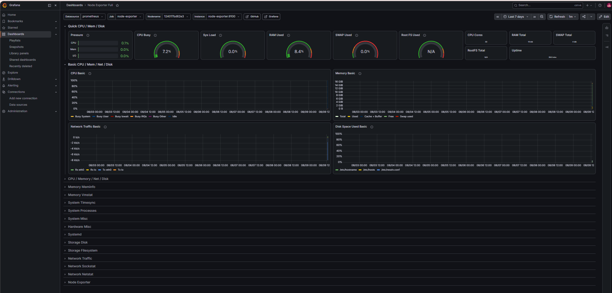

# 📊 Monitoring Stack — Prometheus + Grafana + Node Exporter

A self-hosted monitoring stack that collects and visualizes real-time system metrics (CPU, memory, disk, network) using industry-standard open-source tools, fully containerized with Docker Compose.

## 🎯 Purpose

This project demonstrates a practical DevOps monitoring setup — the same pattern used in production environments to track infrastructure health and performance. Built as part of my transition from Network Engineering into DevOps.

## 🛠️ Tech Stack

- **Docker & Docker Compose** — container orchestration
- **Prometheus** — metrics collection and storage
- **Grafana** — data visualization and dashboards
- **Node Exporter** — exposes host system metrics (CPU, RAM, disk, network)

## 🏗️ Architecture

**Node Exporter** collects system metrics → **Prometheus** scrapes and stores them → **Grafana** visualizes them in dashboards.

## 🚀 How to Run

1. Clone this repository:
```bash
git clone https://github.com/MeLi-afkl/monitoring-stack.git
cd monitoring-stack
```

2. Start the stack:
```bash
docker compose up -d
```

3. Access the services:
   - **Prometheus**: http://localhost:9090
   - **Grafana**: http://localhost:3000 (login: `admin` / `admin`)

4. In Grafana, add Prometheus as a data source (`http://prometheus:9090`), then import dashboard ID `1860` (Node Exporter Full) from grafana.com.

## 📸 Dashboard Preview



## 📈 What It Monitors

- CPU usage and load
- Memory (RAM/SWAP) usage
- Disk space and I/O
- Network traffic (in/out)
- System uptime

## 🔍 Key Learnings

- Configuring service discovery between containers using Docker's internal networking
- Writing Prometheus scrape configurations
- Building and importing Grafana dashboards
- Managing multi-container applications with Docker Compose

## 📝 Future Improvements

- Add alerting rules in Prometheus (Alertmanager)
- Deploy to a cloud VM for remote monitoring
- Add custom application metrics via a Python exporter